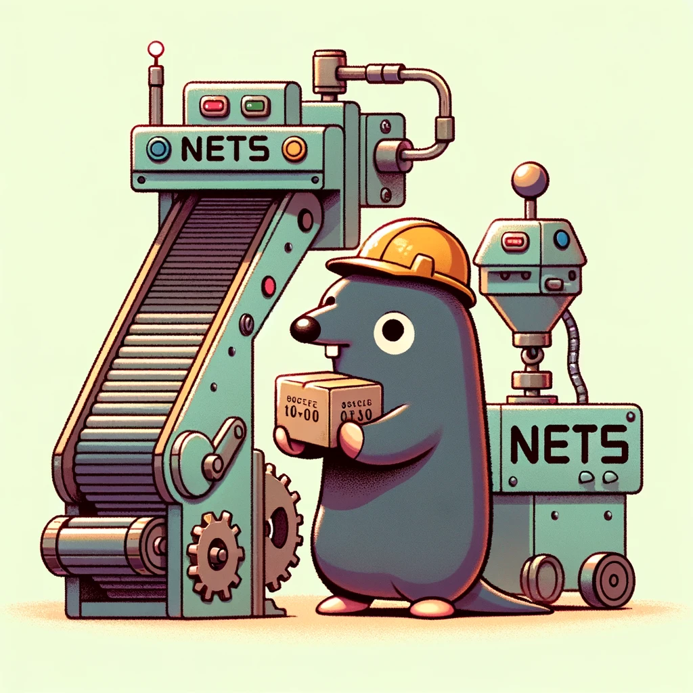

<p align="center"></p>
<div align="center">


</div>
<div align="center">


</div>

<!-- TOC -->

* [NETS 简介](#nets-简介)
  * [架构图](#架构图)
* [使用说明](#使用说明)
  * [环境配置](#环境配置)
  * [快速上手](#快速上手)
  * [Issues](#issues)
* [致谢](#致谢)
* [许可证](#许可证)

<!-- TOC -->

# NETS 简介
一个追求轻量、性能、实用、可快速上手的网络框架。采用工作池模式，已实现协程复用并且可根据并发数量自动扩容协程池。连接建立只需占用3个协程（1个读协程、1个写协程、1个协程池内的工作协程）。

使用面向接口编程和组合设计模式，最大程度提高系统的灵活性、可维护性和可扩展性

**拒绝炫技，保证代码首先要通俗易懂，其次再保证机器运行正常**

现已支持：

* 服务：
  - TCP
  - WebSocket(s)
* 协议：
  - Protocol Buffer
  - JSON
* 功能：
  - [x] 设置连接建立时的前置
  - [x] 设置连接断开时的后置
  - [x] 绑定消息属性
  - [x] 消息处理中间件
  - [x] 自定义编码/解码器
  - [x] 频道广播
  - [x] 全服广播
  - [x] 消息业务panic阻断
  - [x] 停服时优雅关闭所有连接
  - [ ] 支持UDP

## 架构图


# 使用说明

> 启动超简单

```go
package main

import "github.com/451008604/nets/network"

func main() {
  // 启动TCP服务
  serverTCP := network.NewServerTCP(nil)
  serverTCP.Listen()
  // 启动WebSocket服务
  serverWS := network.NewServerWS(nil)
  serverWS.Listen()
  // 阻塞主进程
  network.ServerWaitFlag.Wait()
}
```

## 环境配置

## 快速上手

## Issues

# 致谢

# 许可证

⚖️ Apache-2.0 license
