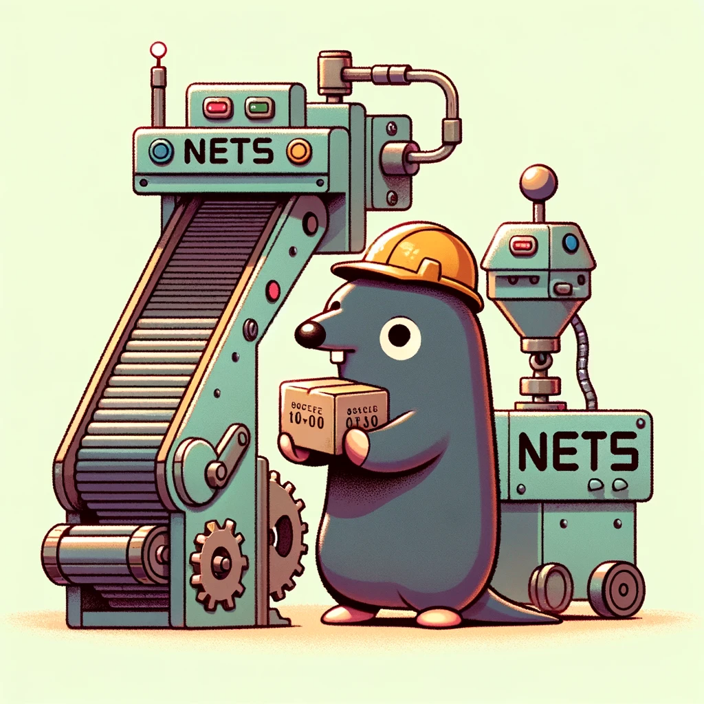

<p align="center"></p>

<div align="center">


</div>
<div align="center">


</div>


# NETS 简介

简介
nets 是一个 模块化、可扩展且支持多协议 的网络框架，核心通过 统一的 IServer/IConnection 接口 把不同传输层抽象出来，用 Router 与 Message 机制实现业务层解耦。它提供了完整的服务器生命周期管理、连接属性、流控以及可配置的编解码方式，适合作为服务端的底层网络库使用。


核心功能

1. 多协议统一框架：同一套 API 能启动 TCP、WebSocket、HTTP、KCP 四种服务，所有协议共享统一的 消息路由、连接管理、流控 机制。
2. 消息路由：router.go 中的 BaseRouter 保存 消息结构体工厂 与 业务处理函数，通过 AddRouter(msgId, tmpl, handler) 注册。
3. 连接管理：ConnectionBase 把 读、写、任务 三个协程解耦，支持超时检测、属性读写、限流 (FlowControl)。
4. 服务器生命周期：ServerManager 负责 注册、启动、阻塞主线程，并在接收到系统信号时优雅关闭所有连接。
5. 协议编解码：可以在配置 AppConf.ProtocolIsJson 之间切换 JSON 与 ProtoBuf 编码。
6. 流量控制：ConnectionBase.FlowControl() 基于每秒请求次数 (AppConf.MaxFlowSecond) 实现限流，超限时自动关闭连接。
7. 广播管理（未完整展示）：提供 分组广播、全服广播 的接口（在 README 中标记已实现）。

项目定位与使用场景
- 轻量级网络框架，适合需要同时提供多协议服务（TCP/WS/HTTP/KCP）的 Go 项目。
- 支持 自定义服务（customserver.go）和 自定义编码/解码，可灵活扩展。

# 使用说明
### 环境配置

### 快速上手

1. **获取源码**
```bash
git clone https://github.com/451008604/nets.git
cd nets
```

2. **安装依赖**
```bash
go mod tidy
```

3. **编写业务代码**（示例 `main.go`）

```go
package main

import (
    "github.com/451008604/nets"
    "google.golang.org/protobuf/proto"
)

// 示例消息结构体（根据实际 .proto 生成）
// type Test_EchoRequest struct { Message string }
// type Test_EchoResponse struct { Message string }

func main() {
    // 注册路由
    nets.GetInstanceMsgHandler().AddRouter(
        int32(Test_MsgId_Test_Echo),               // 消息 ID
        func() proto.Message { return &Test_EchoRequest{} }, // 创建请求对象
        func(conn nets.IConnection, msg proto.Message) {
            req := msg.(*Test_EchoRequest)
            res := &Test_EchoResponse{Message: req.Message}
            conn.SendMsg(int32(Test_MsgId_Test_Echo), res)
        },
    )

    // 注册并启动服务
    nets.GetInstanceServerManager().RegisterServer(
        nets.GetServerTCP(),
        nets.GetServerWS(),
        nets.GetServerHTTP(),
        nets.GetServerKCP(),
    )
}
```

4. **运行**
```bash
go run main.go
```

程序会同时启动 TCP（17001）、WebSocket（17002）、HTTP（17003）和 KCP（17004）四个服务，默认监听 `0.0.0.0`。

5. **测试**（可使用自带的测试用例或自行编写客户端）
```bash
go test ./...   # 运行所有单元/集成测试
```

参考 `client_ws_test.go`、`client_kcp_test.go` 中的示例代码。

> 如需自定义协议、限流或广播功能，请参考源码中的 `router.go`、`connectionbase.go`、`broadcastmanager.go` 等文件。

### => Issues

# 致谢

# 许可证

⚖️[Apache-2.0 license](https://github.com/451008604/nets?tab=Apache-2.0-1-ov-file#)
